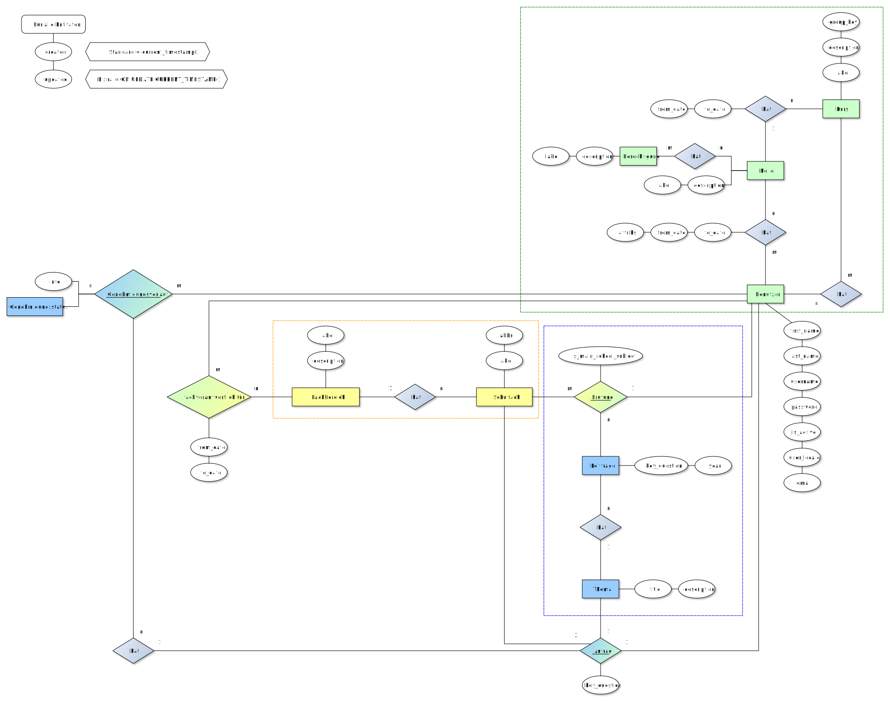

# TK eSchool Manager

TK eSchool Manager ist ein webbasierter Schulmanager zur Verwaltung von Prüfungsthemen für die 5. Prüfungskomponente.

## Todo

1. Betreuende Lehrkraft implementieren
2. Workflow-Postfächer für Genehmigungsstellen implementieren
3. Detailansichten für Vita der Leitfragen implementieren

## Verwendete Modelle

1. ERM (Entity-Relational-Model)
2. ORM (Object-Relational-Model)
3. OOP (Object Oriented Programming)
4. MVC (Model-View-Controller Paradigma)

## ERM-Model und Relation-Model

### ERM

#### Komplettes ERM

#### Genehmigungsprozess (intern)

#### Import von Rohdaten

