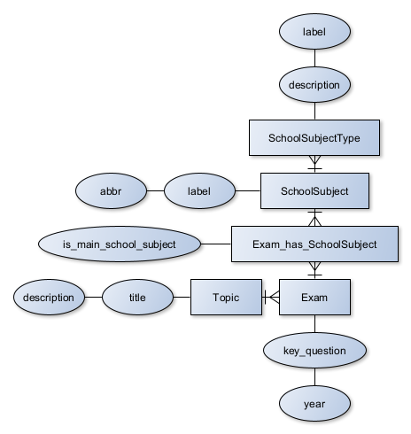
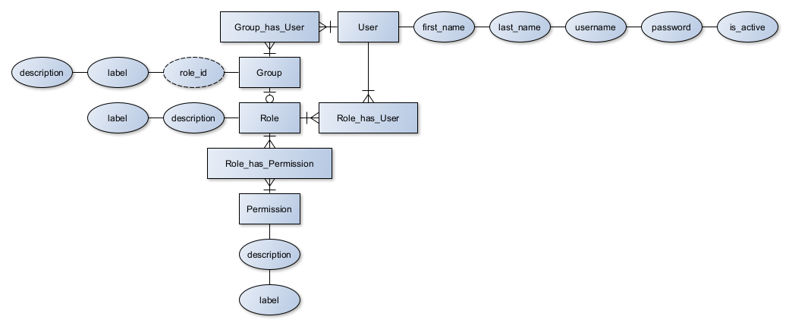
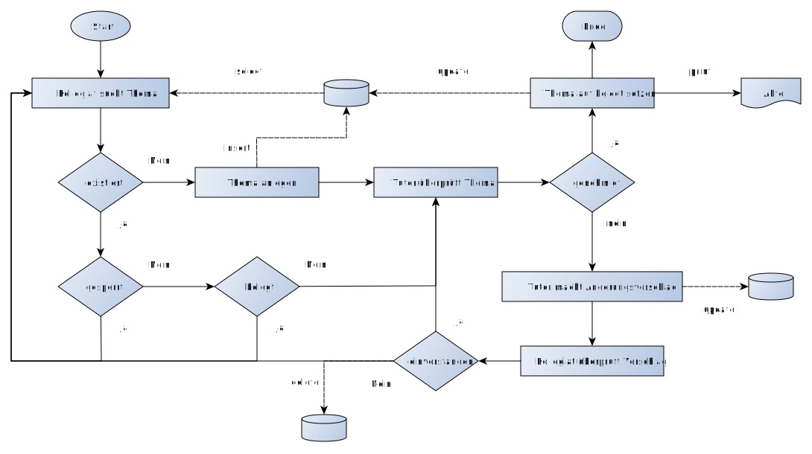
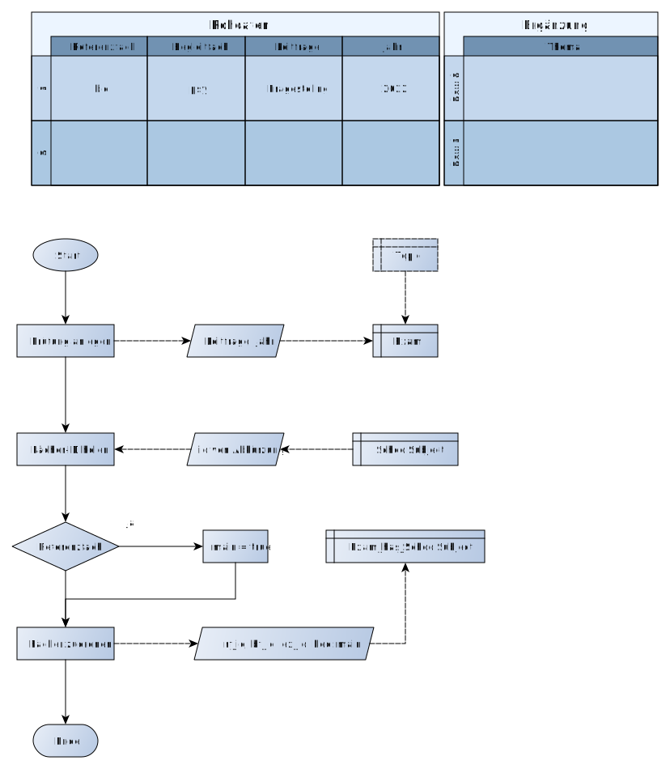

# TK eSchool Manager

TK Dashboard ist ein webbasierter Schulmanager zur Verwaltung von Prüfungsthemen für die 5. Prüfungskomponente.

## ERM-Model und Relation-Model

### ERM

#### Prüfungsthemen und Leitfragen

#### Benutzerverwaltung

#### Genehmigungsprozess (intern)

#### Import von Rohdaten

