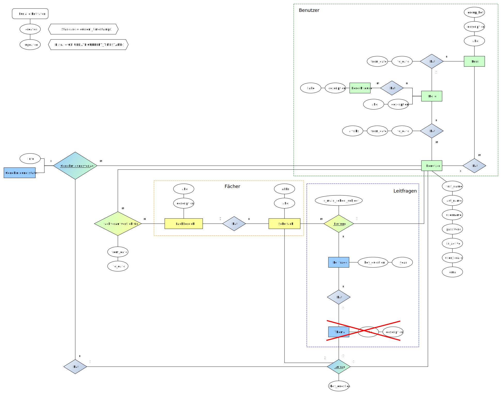

# TK eSchool Manager

TK eSchool Manager ist ein webbasierter Schulmanager zur Verwaltung von Prüfungsthemen für die 5. Prüfungskomponente.

## ERM-Model und Relation-Model

### ERM

#### Komplettes ERM

#### Genehmigungsprozess (intern)

#### Import von Rohdaten

