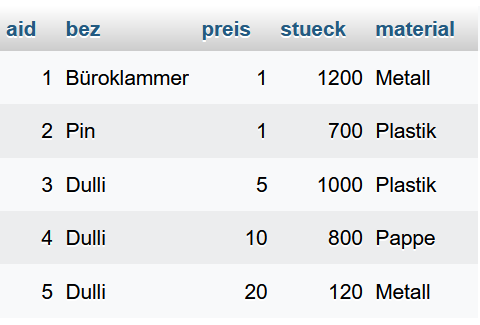

# Übung zu SQL-Abfragen mit Gruppierungen


## Beispieltabelle



## Abfragen

1. Zeige Bezeichnung und Anzahl der jeweiligen Artikel.

````sql
SELECT bez AS Artikel, SUM(stueck) AS Anzahl FROM artikel GROUP BY bez;
````

2. Zeige Bezeichnung, Material und die Anzahl der jeweiligen Artikel.

````sql
SELECT bez AS Artikel, material AS Material, SUM(stueck) AS Anzahl FROM artikel GROUP BY bez, material;
````

3. Von welchen Artikeln gibt es insgesamt jeweils mehr als 1000 Stück?

````sql
SELECT bez AS Artikel, SUM(stueck) AS Anzahl FROM artikel WHERE stueck > 1000 GROUP BY bez;
````

4. Es werden Artikel mit verschiedenen Materialen ausgegeben.
   1. Wieviele Plastikartikel sind das?
   2. Wieviele Artikel je Material sind das?

````sql
SELECT material AS "Artikel nach Matieral", SUM(stueck) AS Anzahl FROM artikel WHERE material ="Plastik";
````

````sql
SELECT material AS "Artikel nach Matieral", SUM(stueck) AS Anzahl FROM artikel GROUP BY material;
````